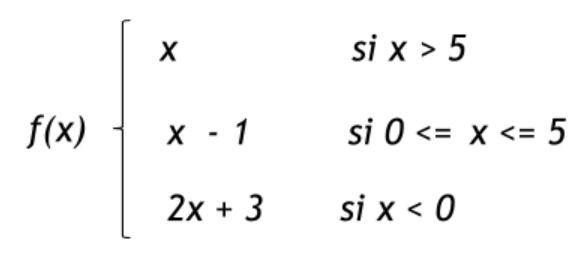
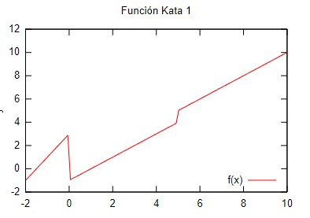

# Kata 0

## Integrantes

- Cesar Mejia (comejia)

## Enunciado

Queremos modelar la siguiente función matemática, definida por partes:
 

 

 
(graficado con [gnuplot](http://www.gnuplot.info/))
 
Se pide implementar _f_ en Haskell.
 
## Pruebas
 
Una vez resuelta la función `f` podemos levantar el entorno de Haskell:
 
```bash
stack ghci
```
 
Y dentro del intérprete podremos evaluar valores límite de la función f en la consola Haskell:
 
```hs
*Main> f 5
4
*Main> f 6
6
*Main> f 4
3
*Main> f 0
-1
*Main> f (-1)
1
```
 
También hacer pruebas por error:
 
```hs
*Main> f 'a'
 
<interactive>:7:3: error:
   * Couldn't match expected type `Number' with actual type `Char'
   * In the first argument of `f', namely 'a'
     In the expression: f 'a'
     In an equation for `it': it = f 'a'
```
 
## BONUS: Testeo automatizado
 
Nuestra solución tiene que estar escrita en el archivo `Spec.hs` del directorio `src`, entonces podemos correr pruebas **automatizadas** para nuestra función _f_ en una terminal:
 
```bash
stack clean
stack test
```
 
Para conocer un poco más del testeo unitario automatizado recomendamos leer [este apunte](https://docs.google.com/document/d/17EPSZSw7oY_Rv2VjEX2kMZDFklMOcDVVxyve9HSG0mE/edit#)

